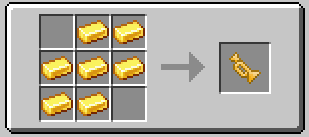

# Fred :)

Mod developed for a modpack for some friends. I don't plan on doing any backports.

The main goal with this mod is just to practice some Java with minecraft modding and add some things we find funny as items.

-   Followed tutorials from [Kaupenjoe](https://www.youtube.com/playlist?list=PLKGarocXCE1EeLZggaXPJaARxnAbUD8Y_).
-   Most of the Trumpet code came from [trumpet-skeleton-fabric](https://github.com/JamiesWhiteShirt/trumpet-skeleton-fabric/).
-   The texture, model and sound effect are also part of [trumpet-skeleton-fabric](https://github.com/JamiesWhiteShirt/trumpet-skeleton-fabric/).
-   The name was the first thing a friend said after I asked for a project name.

## Items

**Trumpet** - Doot until it is done. Repaired with gold nuggets.

## SFX

-   Press `o` [to](https://www.youtube.com/watch?v=TFwXbp9bLlY).

## Commands

> All commands are a .broadcast() to the server.

-   **roll** - random number from 1 to the number provided as argument.
-   **8ball** - it can answer your every question, as long as your question can be answered with yes or no.
-   **quotes** - gives a random quote from a config file, defaults to some random stuff about ULTRAKILL for the lack of a better idea for default quotes.

## Setup

For setup instructions please see the [fabric wiki page](https://fabricmc.net/wiki/tutorial:setup) that relates to the IDE that you are using.
